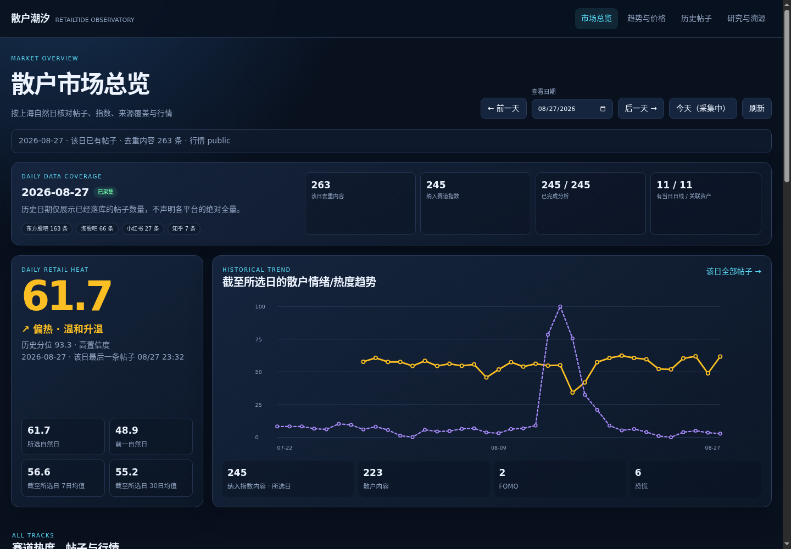
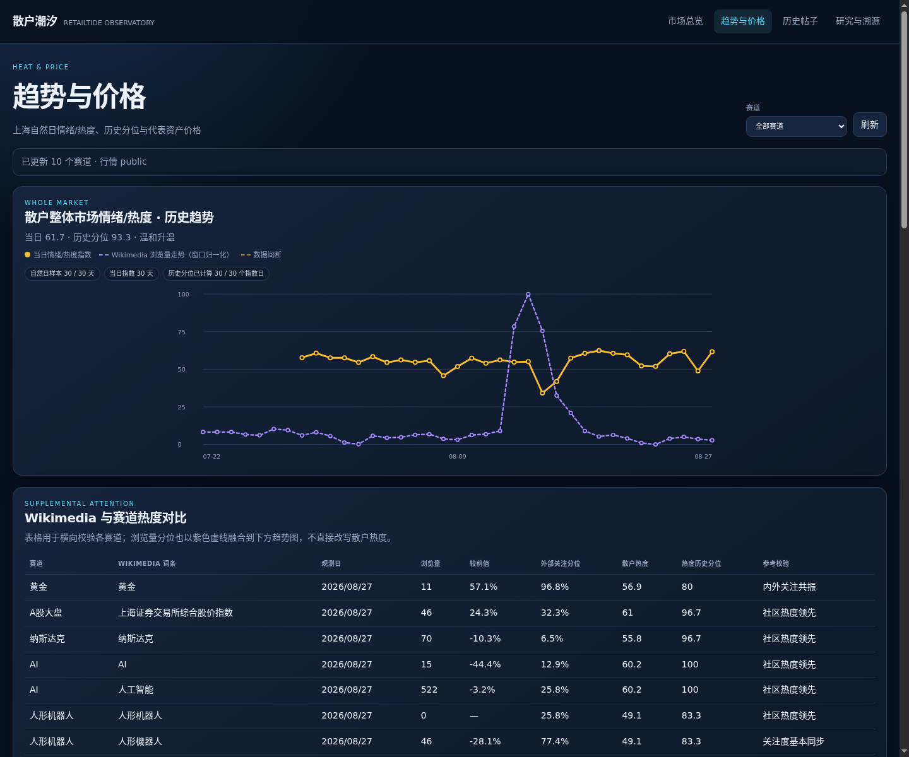
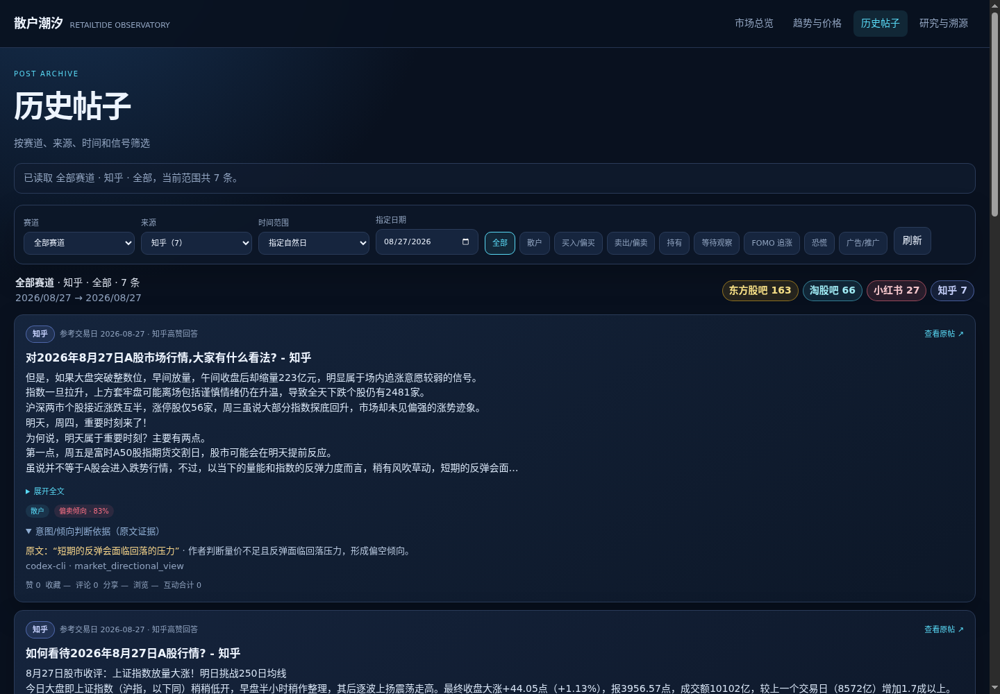
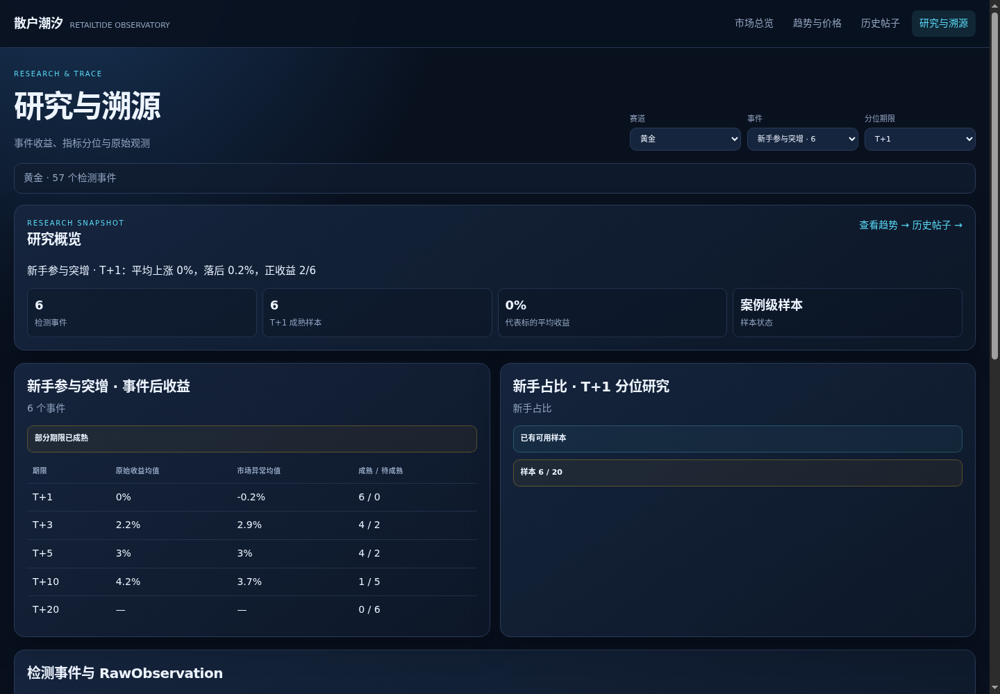

# RetailTide

RetailTide is a multi-source sentiment analysis and event research system for investor communities. It preserves traceable raw observations, resolves entities by Topic, runs LLM analysis, and aggregates heat, trend, and event metrics.

[中文](README.md) · [MIT License](LICENSE)

## Features

- Collects Eastmoney Guba, Taoguba, Zhihu, Xiaohongshu, and Wikimedia Pageviews
- Preserves append-only raw data and normalized content for provenance and version tracking
- Analyzes intent, direction, FOMO, panic, promotion, and spam by `Content × Topic`
- Calculates daily retail heat, historical percentiles, trend direction, and confidence
- Provides market-data linkage, event studies, quantile studies, REST APIs, and a Dashboard
- Supports resumable collection, source-level retries, rate limits, and systemd timers

## System flow

```text
.env / config/*.yaml
        │
        ├─ status: validate source, LLM, and market configuration
        └─ refresh: synchronize Topics, Assets, Aliases, and Sources
                         │
          ┌──────────────┴──────────────┐
          │                             │
     content sources               Wikimedia Pageviews
          │                             │
          └──────────────┬──────────────┘
                         ▼
              RawObservation (append-only)
                         │
          normalize → Content / TrendObservation
                         │
             resolve → Topic / Asset / Author
                         │
              Content × Topic LLM analysis
                         │
        metrics → events → market returns → quality
                         │
                    API / Dashboard
```

## Product UI

### Market overview



### Trends and prices



### Historical posts



### Research and provenance



## Data sources

| Source | Type | Coverage | LLM analysis |
| --- | --- | --- | --- |
| Eastmoney Guba | Content | Public read-only posts and comments | Yes |
| Taoguba | Content | Public read-only discussions | Yes |
| Zhihu | Content / discovery | High-engagement A-share, Hong Kong, and U.S. trading-day review answers | Yes |
| Xiaohongshu | Content / discovery | Read-only search and details through the Spider bridge and project-owned `xiaohongshu-mcp` | Yes |
| Wikimedia Pageviews | Trend | Page-view volume and independent attention | No |

Wikimedia metrics remain separate from the retail heat formula. Zhihu answers use a reference trading date; `EditTime` is used only for relevance validation.

## Analysis and metrics

### LLM analysis

Each content item is analyzed separately for every linked Topic:

- `intent`: `buy`, `sell`, `hold`, `wait`, or `unknown`
- `direction`: `bullish`, `neutral`, `bearish`, or `unknown`
- FOMO: urgency, fear of missing out, social proof, price chasing, and regret
- Emotion and role: panic, novice signals, investor role, and experience
- `promotion`: advertising, courses, paid placement, referral links, and commercial lead generation
- `spam`: flooding, bots, bulk accounts, and similar abnormal content

Intent evidence distinguishes personal actions (`explicit_self_*`), recommendations (`advice_or_recommendation`), market views (`market_directional_view`), and risk warnings (`risk_warning`). `promotion` and `spam` are independent flags and are excluded from retail sentiment, intent, FOMO, and panic metrics.

### Retail heat index

Daily buckets use `Asia/Shanghai` calendar dates and are deduplicated by `Content × Topic`:

- `A`: all content
- `R`: content with `actor_type=retail`, `promotion=false`, and `spam=false`
- `B`, `S`: rows in `R` with `intent=buy` and `intent=sell`
- `F`: rows in `R` with a FOMO score of at least `0.5`
- `P`: rows in `R` with `emotion.panic=true`

```text
retail share       = R / A
retail volume      = R / (R + 20)
intent expression  = min(1, (B + S) / max(R, 1))
emotion activation = min(1, (F + P) / max(R, 1))
directional signal = min(1, abs(B - S) / max(R, 1))

Heat = 100 × clamp(
  0.35 × retail share
  + 0.25 × retail volume
  + 0.20 × intent expression
  + 0.15 × emotion activation
  + 0.05 × directional signal,
  0, 1
)
```

No index is emitted when `A=0` or no content has been analyzed. A cross-Topic item is counted once in the whole-market index.

| Metric | Rule |
| --- | --- |
| High confidence | At least 30 analyzed items and at least 80% analysis coverage |
| Medium confidence | At least 10 analyzed items and at least 50% analysis coverage |
| Low confidence | Analyzed data exists but does not meet either higher threshold |
| Historical percentile | Compared with up to 30 prior valid dates; requires at least 5 prior valid dates |
| Trend score | 50% daily change, 30% consecutive 7-day mean change, 20% consecutive 30-day mean change |
| Trend label | `≥12` accelerating, `≥4` rising, `≤-12` cooling fast, `≤-4` cooling, otherwise stable |

## Quick start

Python 3.10 or later is required. Run these commands from the repository root.

### 1. Install

```bash
python3 -m venv .venv
.venv/bin/pip install -e '.[dev]'
```

### 2. Configure

```bash
cp .env.example .env
chmod 600 .env
.venv/bin/retail-tide setup --env-file .env
```

If `.env` already exists, run `setup` directly instead of overwriting existing credentials with the template. To update an existing configuration:

```bash
.venv/bin/retail-tide setup --env-file .env --force
.venv/bin/retail-tide setup --env-file .env --with-market
```

The public-source User-Agent must include a project name and a valid contact email or project URL:

```dotenv
RETAIL_TIDE_HTTP_USER_AGENT='RetailTide/0.1 (team@example.com)'
```

Never commit API keys, tokens, cookies, or secrets to Git.

### 3. Check configuration

```bash
.venv/bin/retail-tide status
```

`status` reports source, LLM, market, and single-instance-lock readiness without collecting data or printing secrets.

### 4. Initialize data

```bash
# The latest 30 Shanghai calendar dates
.venv/bin/retail-tide refresh --days 30

# From a selected date through the current instant
.venv/bin/retail-tide refresh --since 2026-07-01
```

`refresh` creates the database schema and synchronizes `config/topics.yaml` and `config/assets.yaml`. Re-run the same command after an interruption to resume from its checkpoint.

### 5. Start the service

```bash
.venv/bin/retail-tide serve --host 127.0.0.1 --port 8000
```

| Page | URL |
| --- | --- |
| Dashboard | <http://127.0.0.1:8000/dashboard> |
| Trends and prices | <http://127.0.0.1:8000/trends> |
| Historical posts | <http://127.0.0.1:8000/posts> |
| Research and provenance | <http://127.0.0.1:8000/research> |
| Health check | <http://127.0.0.1:8000/health> |

The Dashboard defaults to the latest completed Shanghai calendar date. Use the date picker or `/dashboard?date=YYYY-MM-DD` to inspect another date.

## Source login sessions (optional)

When Eastmoney or Taoguba requires login, import a browser session authorized by its account owner:

1. Sign in normally and complete any human verification in a browser.
2. Export the relevant request with DevTools **Copy as cURL**, or export storage-state JSON.
3. Set the file mode to `600` and import it:

```bash
chmod 600 /secure/path/taoguba-auth.curl
.venv/bin/retail-tide source auth login taoguba \
  --from-file /secure/path/taoguba-auth.curl
.venv/bin/retail-tide source auth status taoguba

chmod 600 /secure/path/guba-auth.curl
.venv/bin/retail-tide source auth login guba \
  --from-file /secure/path/guba-auth.curl
.venv/bin/retail-tide source auth status guba
```

Delete the temporary file after import. Never paste cookies, cURL text, or session JSON into chat, issues, or logs. Remove local sessions with:

```bash
.venv/bin/retail-tide source auth logout taoguba
.venv/bin/retail-tide source auth logout guba
```

Sessions default to `var/auth/guba.session.json` and `var/auth/taoguba.session.json`. They are not stored in the database or committed to Git. Override their locations with `RETAIL_TIDE_GUBA_SESSION_FILE` and `RETAIL_TIDE_TAOGUBA_SESSION_FILE`.

## Collection

`refresh` is the single collection entry point:

```bash
# One calendar date
.venv/bin/retail-tide refresh --date 2026-08-24

# One or more Topics; --topic may be repeated
.venv/bin/retail-tide refresh --date 2026-08-24 --topic gold
```

Execution order:

1. Run enabled sources concurrently; each source applies its own rate limit and processes its own jobs sequentially.
2. Normalize, deduplicate, and resolve stored content.
3. Run `Content × Topic` LLM analysis.
4. Calculate trends, metrics, events, market returns, and source quality.
5. Report completion, warnings, and retryable work.

### Date options

| Option | Window |
| --- | --- |
| `--date YYYY-MM-DD` | One Shanghai calendar date, `[00:00, next 00:00)` |
| `--days N` | The latest N Shanghai calendar dates, including today |
| `--since YYYY-MM-DD` | From the selected date at 00:00 through the current instant |

A growing current-day window is frozen at its first invocation. Fixed windows store cursors, page counts, and retry times by source and Topic.

### Source boundaries

- Eastmoney and Taoguba paginate newest-first and apply date filters locally.
- Xiaohongshu uses at most one page per query for a recent daily run and 20 pages for a historical window, advancing one page per round.
- Zhihu collects high-engagement answers to A-share, Hong Kong, and U.S. trading-day review questions.
- Wikimedia uses UTC daily buckets and checks upstream availability independently.
- `partial_budget_exhausted` indicates that a page cap was reached; it does not indicate complete coverage.

`RETAIL_TIDE_SOURCE_CONCURRENCY` controls cross-source concurrency, with a default of `5` and a range of `1–8`. Each source remains single-lane and observes its own `*_MIN_INTERVAL`.

### Integrity and retries

- Raw-version key: `source_id + source_item_id + payload_hash`
- Normalized-content key: `source_id + source_item_id`
- One source item matched to multiple Topics is stored once with multiple Topic links
- Source work is recorded in `collection_task`; analysis work is recorded in `analysis_task`
- A failed source is marked `degraded` and retains its checkpoint
- Scheduled jobs retry the pinned date hourly, up to six attempts per source
- LLM failures do not prevent raw content from being stored

### Logs

The CLI logs at `INFO` to stderr by default and writes its final JSON to stdout:

```bash
.venv/bin/retail-tide refresh --date 2026-08-24 --topic gold
.venv/bin/retail-tide --log-level DEBUG refresh --date 2026-08-24 --topic gold
```

Logs exclude post bodies, API keys, and authentication headers.

## systemd deployment

The standard deployment directory is `/opt/retail-tide`. It must contain `.venv` and a mode-`600` `.env`.

### API and Dashboard

```bash
sudo install -m 0644 deploy/retail-tide.service /etc/systemd/system/
sudo systemctl daemon-reload
sudo systemctl enable --now retail-tide.service
```

```bash
systemctl status retail-tide.service
journalctl -u retail-tide.service -f
sudo systemctl restart retail-tide.service
curl -fsS http://127.0.0.1:8000/health
```

The service listens on `127.0.0.1:8000` by default. Use an authenticated reverse proxy or SSH port forwarding for remote access.

### Timers

| Timer | Schedule | Job |
| --- | --- | --- |
| `retail-tide-posts-yesterday.timer` | Daily at 03:00 `Asia/Shanghai` | Collect and analyze the previous Shanghai date; synchronize market data |
| `retail-tide-wikimedia-yesterday.timer` | Daily at 04:00 UTC | Collect Wikimedia data for the previous UTC date |

```bash
sudo install -m 0644 deploy/retail-tide-posts.service /etc/systemd/system/
sudo install -m 0644 deploy/retail-tide-posts-yesterday.timer /etc/systemd/system/
sudo install -m 0644 deploy/retail-tide-wikimedia.service /etc/systemd/system/
sudo install -m 0644 deploy/retail-tide-wikimedia-yesterday.timer /etc/systemd/system/
sudo systemctl daemon-reload
sudo systemctl enable --now retail-tide-posts-yesterday.timer
sudo systemctl enable --now retail-tide-wikimedia-yesterday.timer
systemctl list-timers --all 'retail-tide-posts-*'
systemctl list-timers --all 'retail-tide-wikimedia-*'
```

Timers use `Persistent=true`. After a multi-day outage, run `refresh --date` for each missed date. Older deployments must disable and remove `retail-tide-posts-today.timer`.

### Xiaohongshu deployment references

- [`xiaohongshu-mcp` Linux ARM64 adaptation notes](docs/xiaohongshu-mcp-arm64.md)
- [Manual SMS verification through noVNC](docs/xiaohongshu-novnc-login.md)

These references document compatibility changes, safety boundaries, and generic reverse-proxy requirements without coupling the repository to one VM, Compose stack, systemd layout, or proxy product.

## API

| Endpoint | Purpose |
| --- | --- |
| `/health` | Service health check |
| `/config/status` | Source, LLM, and market configuration |
| `/sources/status` | Source health and quality metrics |
| `/topics` | Active Topic list |
| `/topics/overview` | Market and Topic overview |
| `/topics/{topic_id}/series` | Topic content-heat series |
| `/topics/{topic_id}/attention` | Topic Wikimedia attention series |
| `/trends/attention` | Wikimedia attention series across all Topics |
| `/contents` | Deduplicated content and analysis across all Topics |
| `/topics/{topic_id}/contents` | Content and analysis for one Topic |
| `/metrics` | Aggregated metrics and baseline signals |
| `/events` | Event list |
| `/research/event-study` | Event study |
| `/research/quantile-study` | Quantile study |

## LLM analysis Skill

The repository includes a read-only [`retail-tide-analysis`](skills/retail-tide-analysis/SKILL.md) Skill for querying the platform by date, Topic, source, and signal.

Install it for Codex:

```bash
CODEX_SKILLS_DIR="${CODEX_HOME:-$HOME/.codex}/skills"
mkdir -p "$CODEX_SKILLS_DIR"
cp -R skills/retail-tide-analysis "$CODEX_SKILLS_DIR/"
test -f "$CODEX_SKILLS_DIR/retail-tide-analysis/SKILL.md"
```

Restart Codex or open a new session, then invoke `$retail-tide-analysis`. Build an analysis evidence bundle with:

```bash
python skills/retail-tide-analysis/scripts/retail_tide_query.py bundle \
  --from-date 2026-08-01 --to-date 2026-08-30 \
  --topic semiconductor --post-limit 100
```

The Skill uses HTTP GET APIs by default. It does not read SQLite or trigger collection or analysis jobs.

## Configuration

| Path | Contents |
| --- | --- |
| `.env` | Runtime settings, source credentials, LLM, and market authentication |
| `.env.example` | Environment-variable template and reference |
| `config/topics.yaml` | Topics, aliases, source queries, and page limits |
| `config/assets.yaml` | Representative assets, markets, Topic links, and benchmarks |
| `prompts/` | Versioned LLM schemas and prompts |
| `migrations/` | Database migrations |

Configure an optional fallback LLM with `RETAIL_TIDE_LLM_FALLBACK_*`. Network, timeout, rate-limit, upstream HTTP, and schema-validation errors trigger failover; a valid `unknown` result does not. The providers use separate pacing, and results record the model that produced them.

After changing models, reanalyze content that the previous model returned as `unknown`:

```bash
.venv/bin/retail-tide llm review-compatible \
  --candidate-model OLD_MODEL-via-openai-compatible \
  --candidate-intent unknown
```

## Demo mode

```bash
RETAIL_TIDE_DATA_MODE=demo \
RETAIL_TIDE_DATABASE_URL=sqlite:////tmp/retail-tide-demo.db \
.venv/bin/retail-tide demo run
```

Keep demo databases in `/tmp` or another temporary directory, separate from production data.
